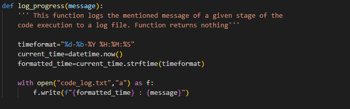
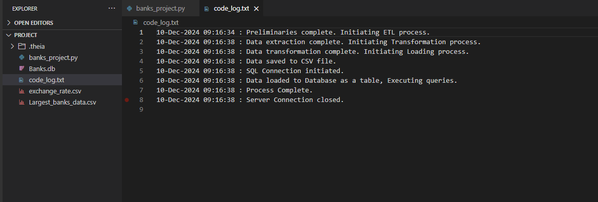
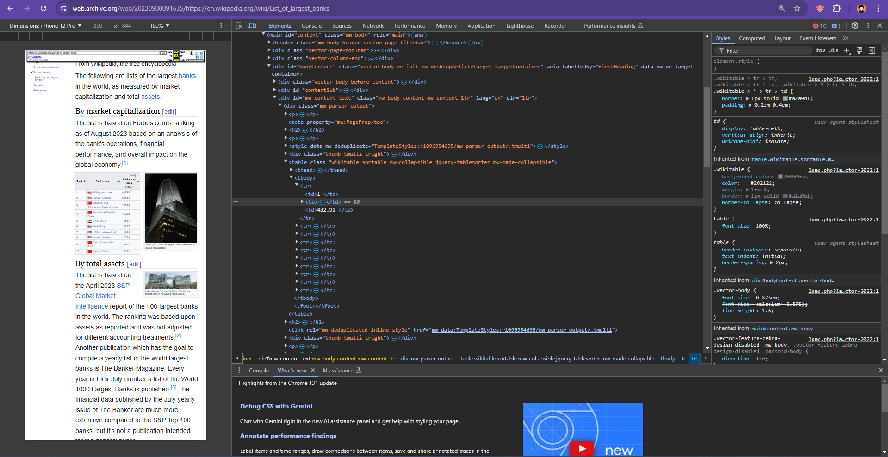
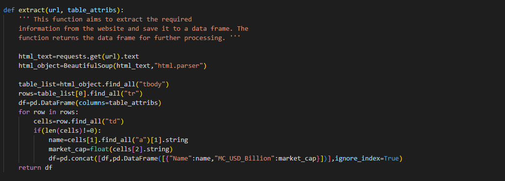
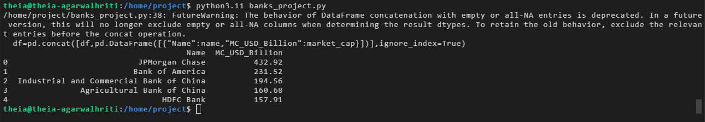
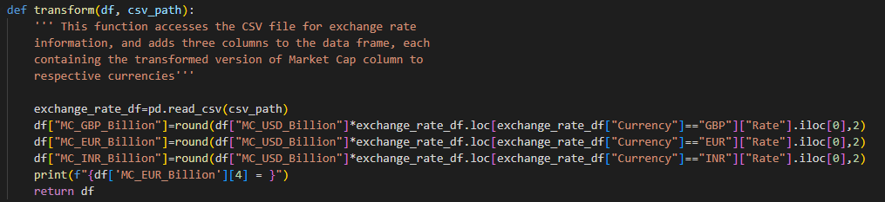
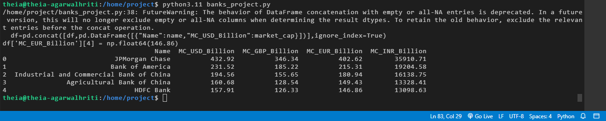
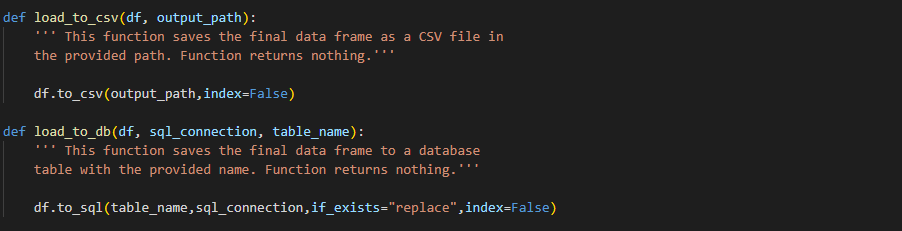
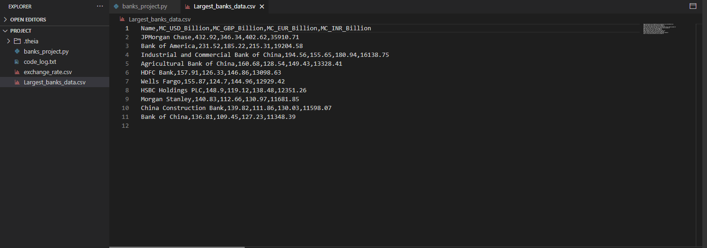
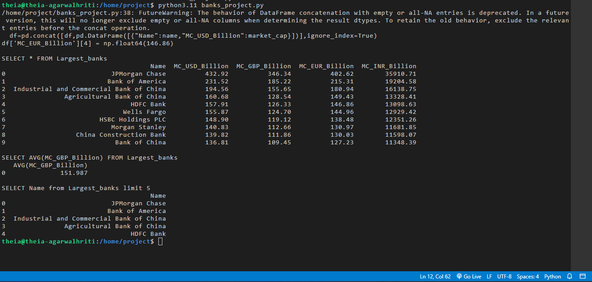

# **Top 10 Largest Banks by Market Capitalization**

## **Description**
This project tests the application of Python programming skills and the concepts of **ETL (Extraction, Transformation, and Loading)** using real-world data. It involves extracting data about the largest banks in the world, transforming it into multiple currencies based on exchange rates, and loading the processed data into both CSV files and a database. The project also demonstrates the ability to query and log operations for seamless data engineering.

---

## **Project Scenario**
You are a **Data Engineer** hired by a multi-national firm to process and manage data related to the top 10 largest banks by market capitalization. Your responsibilities include:
- **Extracting** the relevant data from an online source.
- **Transforming** the data into multiple currencies (USD, GBP, EUR, INR) using provided exchange rates.
- **Loading** the data into a CSV file and a database table for accessibility by global managers.

---

## **Key Tasks**
1. **Extract Data**:
   - Extract tabular data from a web source under the heading *"By Market Capitalization"* and store it in a Pandas DataFrame.

3. **Transform Data**:
   - Add new columns to the DataFrame for market capitalization in GBP, EUR, and INR.
   - Use the exchange rate information provided in a CSV file.
   - Ensure values are rounded to two decimal places.

4. **Load Data**:
   - Save the transformed data locally in a CSV file.
   - Load the data into a SQL database as a table.

5. **Query Data**:
   - Write and execute SQL queries to extract information for below
	- Display all the entries from the table
	- Display the Average GBP in Billion from the table
	- Display the Top 5 Largest Banks from the table 

6. **Logging**:
   - Implement a logging mechanism to track the progress and execution of each step.
   - Maintain detailed log entries for all operations, including data initialization and function calls.

---

## **Pre-requisite**
Ensure the following libraries are installed:
- `pandas`
- `bs4`
- `sqlite3`

You can install the necessary Python packages using the following command:

```bash
pip install pandas bs4 sqlite3
```
---

## **Installation**
1. Clone the repository to your local machine:
   ```bash
   git clone https://github.com/MasterHrit/ETL-Project-with-Python.git
   cd ETL-Project-with-Python
   ```
2. Ensure you have the Pre-requisite Python packages installed.

---

## **Usage**
To run the ETL process, execute the following Python script:
```bash
python etl_script.py
```
This will perform the following operations:
- Extract data from the specified URL page.
- Transform the data by converting market capitalization values into GBP, EUR, and INR.
- Load the transformed data into both a CSV file and a SQLite database.

---

## **Code Understanding**
1. **Logging Process**</br></br>
   - The log_progress function logs messages at various stages of the ETL process to a code_log.txt file.</br></br>
   Log Function</br></br>
   </br></br>
   Logging Output Screen</br></br>
   </br></br>
2. **Extract Function**</br></br>
   - The extract function scrapes the list of largest banks and their market capitalizations in USD from the Wikipedia page.</br></br>
   Inspecting the Webpage to get Insights on Webpage Structure</br></br>
   </br></br>
   Extract Function</br></br>
   </br></br>
   Extracted Data Output</br></br>
   </br></br>
3. **Transform Function**</br></br>
   - The transform function adds columns for market capitalizations in GBP, EUR, and INR based on exchange rate data.</br></br>
   Transform Function</br></br>
   </br></br>
   Transformed Data Output</br></br>
   </br></br>
4. **Load Functions**</br></br>
   - The load_to_csv function saves the transformed data into a CSV file, and the load_to_db function saves it to a SQLite database.</br></br>
   Load Function</br></br>
   </br></br>
   CSV Output</br></br>
   </br></br>
6. **Run Queries**</br></br>
   - The run_query function executes SQL queries on the database to analyze the loaded data.</br></br>
   SQL Queries Output</br></br>
   </br></br>
7. **ETL Process Execution**</br></br>
   - The ETL pipeline is executed by calling the functions in sequence:</br></br>
   ```python
   ''' Here, you define the required entities and call the relevant
	functions in the correct order to complete the project. Note that this
	portion is not inside any function.'''
	
	url="https://web.archive.org/web/20230908091635 /https://en.wikipedia.org/wiki/List_of_largest_banks"
	table_attributes_extraction=["Name","MC_USD_Billion"]
	table_attributes_final=["Name","MC_USD_Billion","MC_GBP_Billion","MC_EUR_Billion","MC_INR_Billion"]
	output_csv_path="./Largest_banks_data.csv"
	database_name="Banks"
	table_name="Largest_banks"
	exchange_rate_csv="exchange_rate.csv"
	log_progress("Preliminaries complete. Initiating ETL process.")
	
	df=extract(url,table_attributes_extraction)
	log_progress("Data extraction complete. Initiating Transformation process.")
	
	transformed_df=transform(df,exchange_rate_csv)
	log_progress("Data transformation complete. Initiating Loading process.")
	
	load_to_csv(transformed_df, output_csv_path)
	log_progress("Data saved to CSV file.")
	
	conn=sq.connect("Banks.db")
	log_progress("SQL Connection initiated.")
	
	load_to_db(transformed_df, conn, table_name)
	log_progress("Data loaded to Database as a table, Executing queries.")
	
	query1=f"SELECT * FROM {table_name}"
	run_query(query1, conn)
	query2=f"SELECT AVG(MC_GBP_Billion) FROM {table_name}"
	run_query(query2, conn)
	query3=f"SELECT Name from {table_name} limit 5"
	run_query(query3, conn)
	log_progress("Process Complete.")
	
	conn.close()
	log_progress("Server Connection closed.")
```
